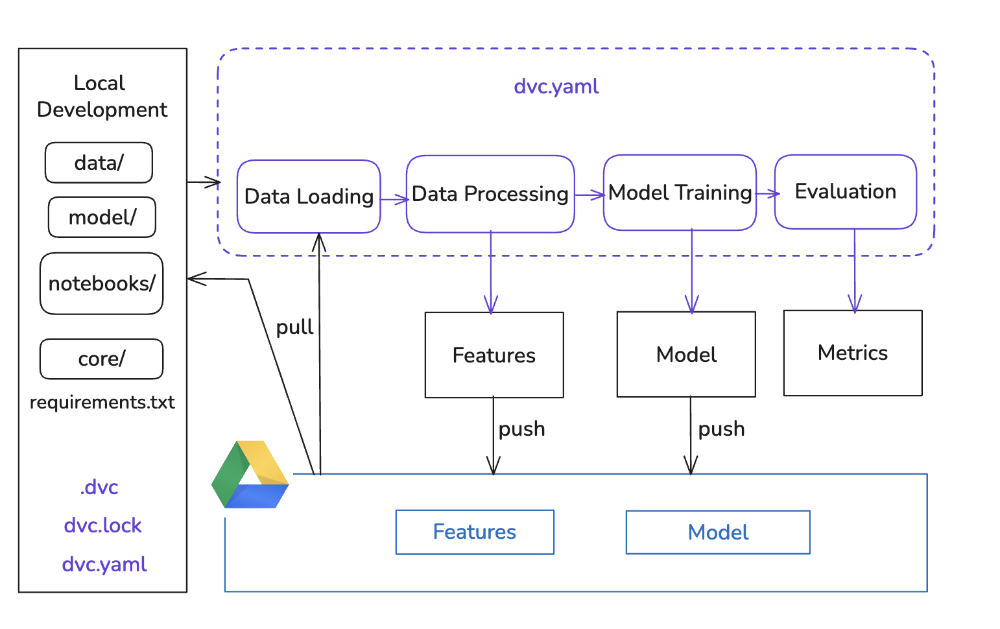

# Model Training


A repository for training and deploying machine learning models for sentiment analysis.

## Table of Contents

- [Features](#features)
- [Module Structure](#module-structure)
- [Requirements](#requirements)
- [Installation](#installation)
- [Local Setup](#local-setup)
- [Data Versioning Control](#dvc)
- [GitHub Actions & CI/CD](#️-github-actions--cicd)
- [Linting](#-linting)
- [Resources](#-resources)
- [Use of GenAI](#-use-of-genai)

## Features

- `sentiment_model_training`: A Python package for sentiment analysis model training
- Modular design with separate components for:
  - Data acquisition
  - Preprocessing
  - Model training
  - Model evaluation
- **GitHub Actions**:
  - Automatically publishes the trained model to **GitHub Releases**
  - Publishes the bag of words vectorizer to **GitHub Releases**
  - **Automatic versioning** with GitVersion

## Module Structure

The project follows the [Cookiecutter Data Science](https://github.com/drivendataorg/cookiecutter-data-science) project structure, a widely adopted standard template for data science projects. Our implementation is organized as follows:

```
├── .bandit            <- Bandit security linter configuration
├── .coverage          <- Coverage report data file
├── .flake8            <- Flake8 linter configuration
├── .gitignore         <- Git ignore file
├── .pylintrc          <- Pylint linter configuration
├── LICENSE            <- MIT License
├── README.md          <- The top-level README for developers using this project
├── GitVersion.yml     <- GitVersion configuration for automatic versioning
├── pyproject.toml     <- Project configuration file with package metadata
├── requirements.txt   <- Requirements file for reproducing the analysis environment
├── dvc.yaml           <- DVC pipeline stages configuration
├── dvc.lock           <- Current state of the DVC pipeline
├── dvc_pipeline.png   <- Visual diagram of the DVC pipeline
├── metrics.json       <- Evaluation metrics of the DVC evaluation stage
│
├── .dvc/              <- DVC configurations and cache
├── .github/           <- GitHub-specific files
│   ├── workflows/     <- GitHub Actions CI/CD workflows
│   └── PULL_REQUEST_TEMPLATE.md <- Template for pull requests
│
├── data/              <- Directory containing all data files
│   ├── raw/           <- Directory for raw data (populated by DVC pipeline)
│   │   └── raw.tsv    <- The original, immutable restaurant reviews data
│   └── processed/     <- Directory for processed data (populated by DVC pipeline)
│       ├── processed.npy  <- The processed dataset for modeling
│       ├── labels.pkl     <- Labels for sentiment analysis
│       ├── X_train.pkl    <- Training data features
│       ├── y_train.pkl    <- Training data labels
│       ├── X_test.pkl     <- Test data features
│       └── y_test.pkl     <- Test data labels
│
├── lint/              <- Custom linting rules and configurations
│   ├── __init__.py    <- Makes lint a Python package
│   └── custom_rules.py <- Custom Pylint rules for ML best practices
│
├── metrics/           <- Generated metrics and badges
│   ├── coverage.svg   <- Coverage badge
│   ├── ml_scores.json <- ML performance metrics
│   ├── ml_test_score.svg <- ML test score badge
│   └── pylint.svg     <- Pylint score badge
│
├── model/             <- Trained and serialized models and model artifacts (populated by DVC pipeline)
│   ├── model.pkl      <- The trained Gaussian Naive Bayes model
│   └── bag_of_words.pkl <- The bag of words vectorizer for text preprocessing
│
├── notebooks/         <- Jupyter notebooks for exploration and demonstration
│   ├── 1.0-g17-exploration_of_data.ipynb <- Exploratory data analysis, separate from production code
│   └── 2.0-g17-demonstration_of_data.ipynb <- Model demonstration using production code
│
├── sentiment_model_training/ <- Source code for use in this project
│   ├── __init__.py    <- Makes sentiment_model_training a Python package
│   │
│   └── modeling/      <- Scripts to train models and perform analysis
│       ├── __init__.py
│       ├── get_data.py  <- Script to download or generate data
│       ├── preprocess.py <- Script to transform data
│       ├── train.py   <- Script to train the sentiment analysis model
│       └── evaluate.py <- Script to evaluate model performance
│
└── tests/             <- Automated tests
    ├── __init__.py    <- Makes tests a Python package
    ├── conftest.py    <- Pytest configuration and fixtures
    ├── test_feature_and_data.py <- Tests for data and feature processing
    ├── test_ml_infrastructure.py <- Tests for ML infrastructure
    ├── test_model_development.py <- Tests for model development
    ├── test_monitoring.py <- Tests for monitoring capabilities
    └── test_mutamorphic.py <- Metamorphic testing
```

Similar to the cookiecutter template, our project separates:

- **Source code** (`sentiment_model_training/`) - Production ML code
- **Data** (`data/`) - Raw and processed datasets (managed by DVC)
- **Models** (`model/`) - Trained models and artifacts (managed by DVC)
- **Documentation** (`README.md`) - Project documentation
- **Dependencies** (`requirements.txt`, `pyproject.toml`) - Package and dependency management
- **Notebooks** (`notebooks/`) - Exploratory analysis and demonstrations
- **Tests** (`tests/`) - Comprehensive test suite
- **Linting** (`lint/`, `.pylintrc`, `.flake8`, `.bandit`) - Code quality and security tools
- **Metrics** (`metrics/`) - Performance metrics and badges
- **CI/CD** (`.github/`) - GitHub Actions workflows
- **Configuration** (`GitVersion.yml`, `dvc.yaml`, `dvc.lock`) - Tool configurations

The naming conventions are adapted to fit our specific sentiment analysis use case, while maintaining the logical separation of concerns of the cookiecutter template.

## Requirements

- Python 3.10
- Restaurant Reviews dataset (automatically downloaded by the script)

### Python Dependencies

The project requires several Python packages:

- pandas - For data manipulation
- scikit-learn - For machine learning algorithms
- numpy - For numerical operations
- lib-ml - Custom library for preprocessing (from remla25-team17)
- joblib - For model serialization
- requests - For data download
- nltk - For natural language processing

## Installation

Install all dependencies using the requirements.txt file:

```bash
pip install -r requirements.txt
```

Alternatively, you can install the package in development mode:

```bash
pip install -e .
```

## Local Setup

**Clone the repository:**

```bash
git clone git@github.com:remla25-team17/model-training.git
cd model-training
```

**Install dependencies:**

```bash
pip install -r requirements.txt
```

**Run the complete pipeline:**

```bash
# Step 1: Download the data (Or use DVC instead)
python sentiment_model_training/modeling/get_data.py

# Step 2: Preprocess the data (Or use DVC preprocessed data instead)
python sentiment_model_training/modeling/preprocess.py

# Step 3: Train the model (Or use DVC instead)
python sentiment_model_training/modeling/train.py

# Step 4: Evaluate the model (optional)
python sentiment_model_training/modeling/evaluate.py
```

**Run tests with coverage**

```bash
pytest --cov=sentiment_model_training
```

**Explore and Demonstrate with Jupyter Notebooks:**

Following cookiecutter data science principles, we separate exploratory code from production code using Jupyter notebooks

- `notebooks/exploration.ipynb` - Contains data exploration, analysis, and visualization. This notebook helps understand the dataset characteristics and inform modeling decisions but keeps exploratory code separate from production.
- `notebooks/demonstration.ipynb` - Shows how to use the trained model for predictions and evaluation. This notebook demonstrates the application of the production code rather than developing new features.

## [Data Version Control](#dvc)

We have set up Data Version Control (DVC) as our data management and ML pipeline automation solution for collaborative deployment.
This helps us manage our dataset, ensure versioning, pull artifacts from external storage locations and have it shared across our team. Also, it allows us to track experiments and model versions.

> Before going further, please [install DVC](https://dvc.org/doc/install)

For local usage, it's recommended to create a virtual environment:

```bash
python3 -m venv .env
source .env/bin/activate
```

DVC enabled cross-project reusiability for our data artifact. We utilize DVC remotes which provides access to extral storage location. In our case, we support Google Drive remote.

To get started with DVC, we run `dvc init` command (For this repository, we already have this setup).

### [Setting up external storage with Google Drive](https://dvc.org/doc/user-guide/data-management/remote-storage/google-drive#url-format) (Already done)

1. Create a Folder in your Google Drive and give access to the users in your group.
2. Set up the Google Drive remote folder URL:

```bash
dvc remote add -d myremote gdrive://1bujWS5qyqKhs28Fwn5cPZ5Nr8brB7QoT
```

3. Use custom Google Cloud project to add extra level of permissions for the Google Drive remotes to connect to Google Drive. This can be used to apply API usage limits and allows us to set up a Service Account for automated tasks (e.g. CI/CD):

   1. Sign into the [Google API Console](https://console.developers.google.com/). DVC will use this API to connect to Google Drive. This will require a Google Cloud project that allows Drive API connections and its OAuth credetianls (see [doc](https://dvc.org/doc/user-guide/data-management/remote-storage/google-drive)).
   2. [Create](https://cloud.google.com/resource-manager/docs/creating-managing-projects#creating_a_project) a project for DVC remote connection.
   3. Add principals (e.g. users that work on the same project) and assign permissions.
   4. [Enable the Drive API](https://developers.google.com/drive/api/v2/about-sdk) from the `APIs & Services Dashboard`, then find and select `Google Drive API`.
   5. In the `APIs & Services Dashboard`, click on OAuth consent screen and click on `Create`. For the Application name, use e.g. `DVC remote storage`.
   6. In the same dashboard view, click on `Credential` and then `Create Credentials`, select `OAuth client ID`. Add `http://localhost:8080/` in the authorized redirect URLs. This will identify our app (`remla`) to the Google OAuth servers. The newly generated `clientID` and `client secret` should be shown. These credentials are used to generate the authorization URL that is used to connect to the Google Drive.
   7. **This needs to be done by every user locally**: Set up the credentials:

      `dvc remote modify myremote gdrive_client_id 'client-id' --local` and

      `dvc remote modify myremote gdrive_client_secret 'client-secret' --local`

4. Store the data in the project's cache: `dvc add data/` and the model: `dvc add model/` (not needed if pipeline below is setup)
5. Push the data to our remote storage: `dvc push`
6. `dvc pull` downloads tracked data from our dvc remote to the cache, and links the files to the workspace.

### DVC Pipeline (Already setup):

1. Data downloading stage:

```bash
dvc stage add -n get_data \
  -o data/raw/raw.tsv \
  python sentiment_model_training/modeling/get_data.py
```

2. Data preprocessing stage:

```bash
dvc stage add -n preprocess \
  -d sentiment_model_training/modeling/preprocess.py \
  -d data/raw/raw.tsv \
  -o data/processed/processed.npy \
  -o data/processed/labels.pkl \
  -o model/bag_of_words.pkl \
  python sentiment_model_training/modeling/preprocess.py
```

3. Model training stage:

```bash
dvc stage add -n train \
  -d sentiment_model_training/modeling/train.py \
  -d data/processed/processed.npy \
  -d data/processed/labels.pkl \
  -d model/bag_of_words.pkl \
  -o model/model.pkl \
  -o data/processed/X_test.pkl \
  -o data/processed/y_test.pkl \
  python sentiment_model_training/modeling/train.py
```

4. Evaluation stage:

```bash
dvc stage add -n evaluate \
  -d sentiment_model_training/modeling/evaluate.py \
  -d model/model.pkl \
  -d data/processed/X_test.pkl \
  -d data/processed/y_test.pkl \
  -M metrics.json \
  python sentiment_model_training/modeling/evaluate.py
```

> You can inspect pipeline configurations at `dvc.yaml`.

Now, we can run `dvc repro` which will execute all the stages in our pipeline, or run `dvc repro <pipeline_name>` for a specific stage.

`dvc push` can now be run to store the results of `model/` and `data/` on the remote GDrive storage and use `dvc pull` to use that data locally.

The diagram below provides an overview of our DVC setup, illustrating the four-stage pipeline and its interaction with Google Drive storage during local development:


### DVC Versioning

Our ML pipeline is version-controlled, and you can go back in time to any previous version and reproduce exactly what was done, including the code, data, model and metrics. For this, we use Git commits to version code and pipeline and DVC to version data, model, and metrics:

For example, if a change was made in `train.py`, do the following:

```bash
git add .
git commit -m "New logic or hyperparams in train.py"
```

Then rollback:

```bash
git checkout <old_commit_id>
dvc checkout
```

And rerun the entire previous pipeline: `dvc repro`

### Metrics

Evaluation metrics are stored in `metrics.json` and are generated as part of the `evaluation` stage. We register the following metrics:

- accuracy
- precision
- recall

Run `dvc exp show` to explore the results of different experiments/models.

---

## [Linting](#-linting)

To maintain code quality and consistency, this project uses the following linting tools:

- **Pylint** - A comprehensive linter that checks for errors, enforces coding standards, and looks for code smells
  - Includes a **custom Pylint checker** located in `lint/custom_rules.py` to identify unnecessary iteration (`for` and `while` loops), encouraging vectorized solutions in machine learning contexts.
- **Flake8** - A wrapper around PyFlakes, pycodestyle, and McCabe for style guide enforcement
- **Bandit** - A security linter designed to find common security issues in Python code

### Running Linting Checks Locally

You can run these checks from the project root (`model-training/`):

#### Install Linting Tools

All necessary linting tools are included in the requirements.txt file:

```bash
pip install -r requirements.txt
```

For the custom Pylint rules, install the package in development mode:

```bash
pip install -e .
```

#### Running Pylint

Run pylint with the custom rules:

```bash
pylint --load-plugins=lint.custom_rules .\sentiment_model_training\
```

#### Running Flake8

Check code style with Flake8:

```bash
flake8 .\sentiment_model_training\
```

#### Running Bandit

Scan for security issues with Bandit:

```bash
 bandit -c .bandit -r sentiment_model_training/
```

---

## [GitHub Actions & CI/CD](#️-github-actions--cicd)

- **Automated ML Pipeline:**

  - Every push triggers the GitHub workflow that builds and releases the model
  - The pipeline runs the complete ML workflow: get data → preprocess → train model
  - Trained model and bag of words are automatically released

- **GitHub App Authentication:**

  For this project, we use a **GitHub App** to handle authentication in our CI/CD pipeline. Instead of relying only on GitHub's default `GITHUB_TOKEN`, which can sometimes have limited access (e.g. to trigger pre-release), the GitHub App gives us:

  - **Better security:** We can control exactly what the app is allowed to do (e.g. creating releases) without giving it more access than necessary.
  - **Reliable access:** The app works well even when we need to push images or create releases across different repositories or teams in the same organization.
  - **Clear traceability:** Every action is marked as being done by the GitHub App, so it's easy to see where changes come from.

- **Versioning:**
  - We use **GitVersion** to handle versioning automatically. GitVersion analyzes the repository's Git history and branch structure to generate a **semantic version number** (SemVer) without needing manual tagging.
  - This ensures that every build and release is consistently versioned, reducing human error and making versioning fully traceable to Git history.
  - Versioning rules:
    - Merges to `main` bump a stable version (e.g., `1.0.0`)
    - Builds from feature branches or pre-release branches (i.e., `develop`) are marked as **pre-releases** (e.g., `1.1.0-canary.5`)
  - The version is automatically injected into the package's `pyproject.toml` file during CI/CD

---

## [Resources](#-resources)

- [Cookiecutter Data Science](https://github.com/drivendataorg/cookiecutter-data-science) - The project template that inspired our structure
- [GitVersion](https://gitversion.net/) - Tool for automated versioning
- [Semantic Versioning](https://semver.org/) - Version numbering guidelines
- [GitHub App Token](https://docs.github.com/en/apps/creating-github-apps/authenticating-with-a-github-app/generating-a-user-access-token-for-a-github-app) - Documentation for GitHub App authentication

## [Use of GenAI](#-use-of-genai)

- GenAI was used to generate the structure of the README.md file.
- GenAI was used to generate the demonstration and exploration notebooks as part of an example as to how exploratory code can be separated from production code, thus following the cookiecutter template and project rubric.
